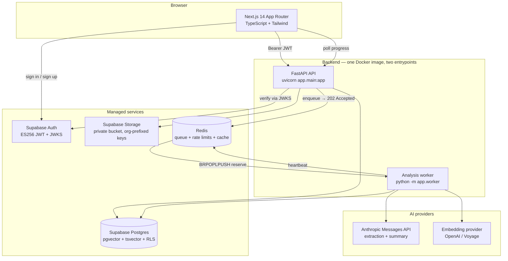
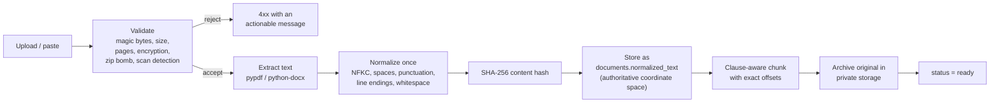
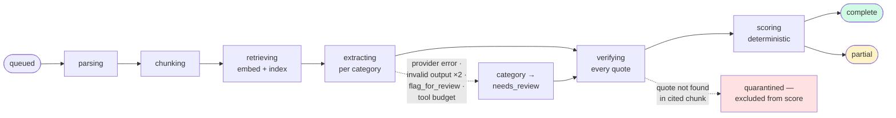
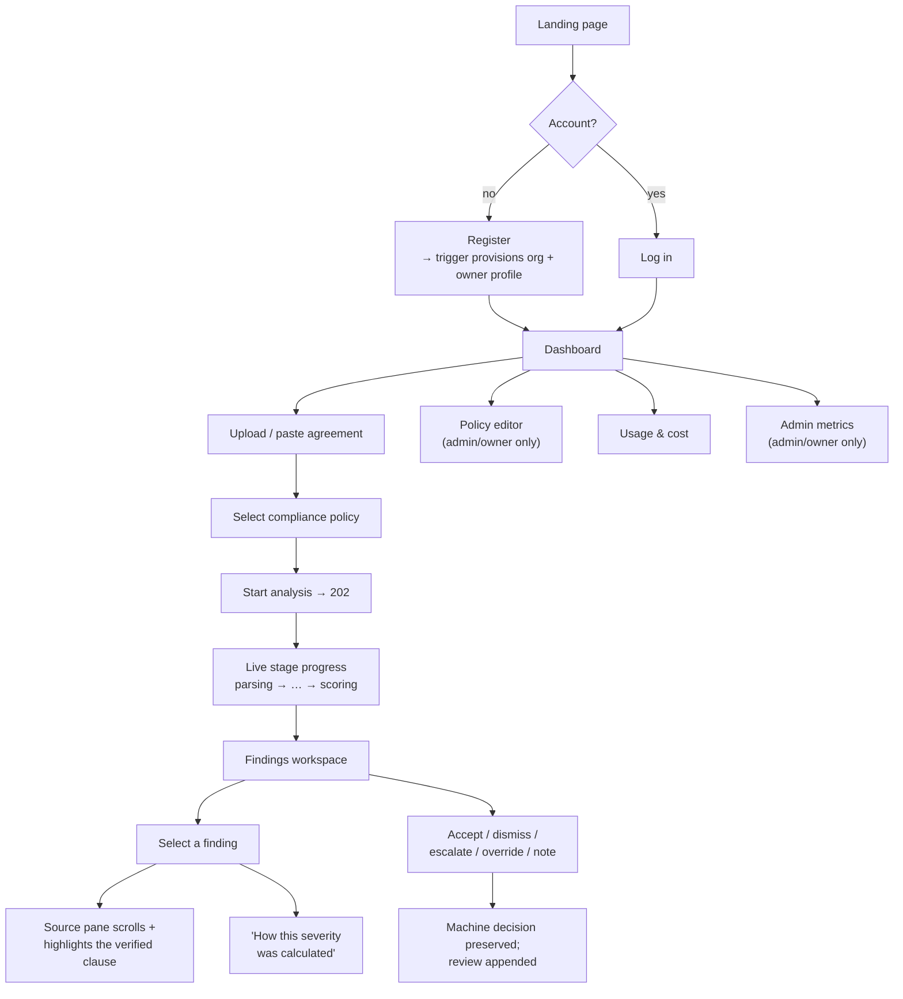
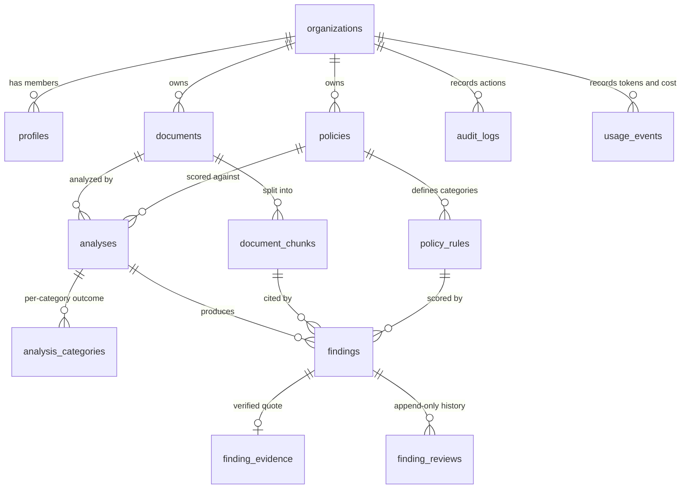
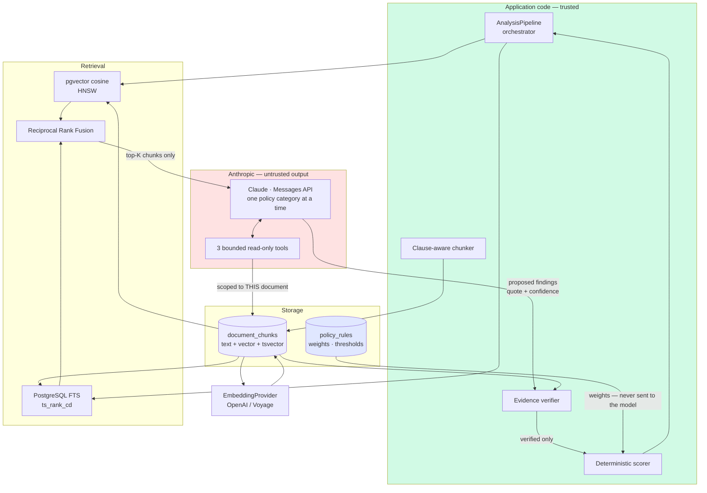
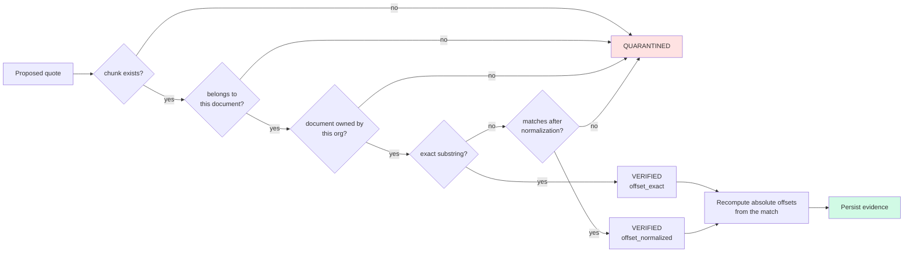
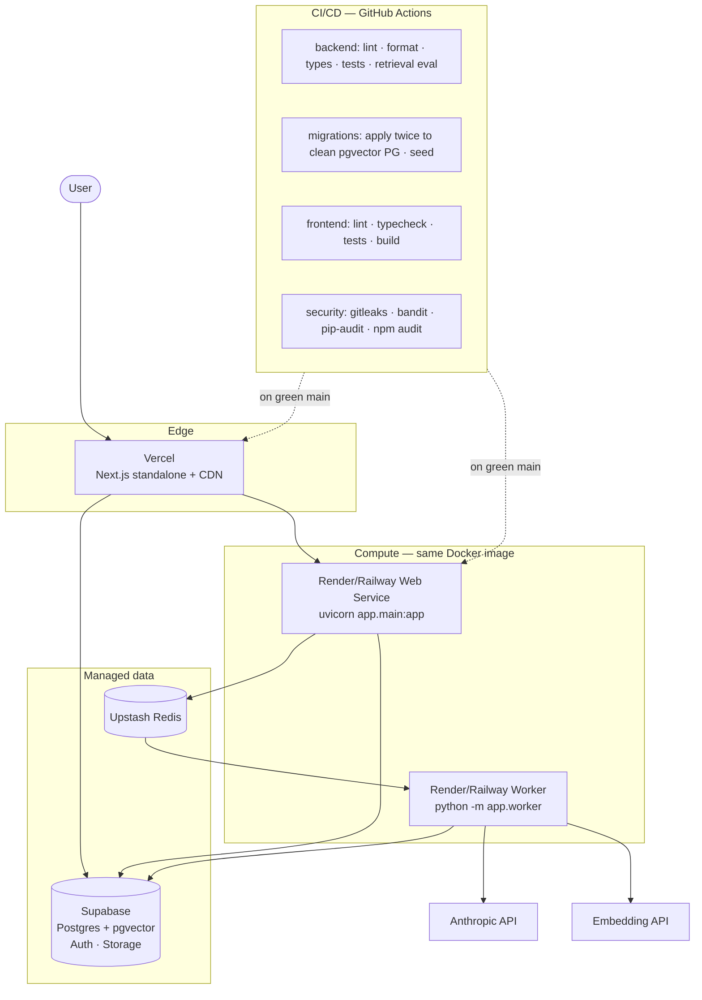

# design.md — ClauseGuard

**Technical design document.**
Project topic: **Automated EULA Compliance Extraction**. Application name: ClauseGuard.

Companion to [`plan.md`](plan.md). This document covers *how* the system is
built: architecture, data flow, user flow, schema, API, AI components,
deployment, and the reasoning behind each major decision.

All diagrams are Mermaid sources under [`docs/diagrams/`](docs/diagrams/), which
GitHub renders inline and which remain editable at
[mermaid.live](https://mermaid.live).

---

## Contents

1. [System architecture](#1-system-architecture)
2. [Data flow](#2-data-flow)
3. [User flow](#3-user-flow)
4. [Database schema](#4-database-schema)
5. [API architecture](#5-api-architecture)
6. [AI component design](#6-ai-component-design)
7. [Deployment architecture](#7-deployment-architecture)
8. [Technical decision rationale](#8-technical-decision-rationale)

---

## 1. System architecture

📄 Source: [`docs/diagrams/01-system-architecture.mermaid`](docs/diagrams/01-system-architecture.mermaid)



### 1.1 Component responsibilities

| Component | Responsibility | Notably does **not** |
|---|---|---|
| **Next.js frontend** | Rendering, route guards, evidence highlighting, reviewer actions | Hold any secret beyond the Supabase anon key; enforce authorization |
| **FastAPI API** | AuthN/AuthZ, validation, parsing, chunking, CRUD, enqueue | Call the LLM on the request path |
| **Worker** | The six-stage analysis pipeline | Serve HTTP |
| **Postgres** | Durable state, vector + full-text search, RLS | Store secrets |
| **Redis** | Job queue, rate-limit windows, dedupe keys, heartbeats | Hold anything that must survive a flush |
| **Supabase Auth** | Identity, sessions, JWT issuance | Authorization decisions (those are ours) |

### 1.2 Layering inside the backend

```
app/
├── api/v1/        routers — HTTP shape only
├── api/deps.py    authentication, authorization, rate limiting
├── core/          config, errors, logging, security, JWKS, rate limiting
├── db/            asyncpg pool + repositories (all queries org-scoped)
├── jobs/          durable Redis queue
├── providers/     LLMProvider + EmbeddingProvider abstractions
├── schemas/       Pydantic request/response + extraction contracts
├── services/      domain logic — normalization, chunking, retrieval,
│                  extraction, verification, scoring, prompts, tools, pipeline
├── main.py        FastAPI app, middleware, error handling
└── worker.py      worker entrypoint
```

Routers never touch SQL; repositories never make HTTP calls; services are pure
domain logic and are unit-testable without infrastructure. This is why the
scoring, verification, chunking and RRF logic can be tested exhaustively with no
database and no network.

---

## 2. Data flow

📄 Source: [`docs/diagrams/02-analysis-pipeline.mermaid`](docs/diagrams/02-analysis-pipeline.mermaid)

### 2.1 Upload → ready (synchronous, on the request path)



### 2.2 Analysis (asynchronous, in the worker)



Each stage transition is persisted, so a restarted worker resumes from
`analyses.completed_categories` rather than re-paying for finished work.

### 2.3 The offset invariant

Everything downstream depends on one rule:

```
documents.normalized_text is the single authoritative coordinate space.

  document_chunks.start_offset / end_offset  → index into it
  finding_evidence.doc_start_offset / …      → index into it
  frontend highlight range                   → index into it

  INVARIANT:  text[chunk.start_offset : chunk.end_offset] == chunk.text
```

Enforced by `verify_offsets()` and asserted across the sample agreement,
duplicate text, Windows line endings, and oversized clauses.

---

## 3. User flow



### 3.1 Key screens

| Screen | Purpose | States handled |
|---|---|---|
| Dashboard | Real counts, recent documents/analyses, risk distribution, pending reviews, 30-day cost | loading · empty · error |
| Upload | Drag-drop, file picker, paste tab, policy selector | validation · scanned-PDF explanation · upload progress |
| Analysis progress | Seven real stages, per-category detail | running · partial · failed · degraded retrieval |
| **Findings workspace** | Two-pane: finding cards + source document | empty · filtered-empty · quarantined · degraded |
| Policy editor | Categories, weights, thresholds, escalation, versioning | validation errors · duplicate categories · saved |
| Usage | Tokens, cached tokens, cost, daily chart | empty period |
| Admin metrics | Success/error rate, stage latency, queue depth, workers | 403 for non-admins |

### 3.2 The core interaction

Selecting a finding must: open the source pane, scroll to the exact clause,
highlight the verified range, and retain surrounding context. This is driven
entirely by stored absolute offsets — `splitForHighlight()` refuses to render a
highlight if the offsets do not resolve, rather than highlighting approximately.

---

## 4. Database schema

📄 Source: [`docs/diagrams/06-data-model.mermaid`](docs/diagrams/06-data-model.mermaid)



### 4.1 Tables

| Table | Purpose | Key columns |
|---|---|---|
| `organizations` | Tenancy root | `slug` (unique), `is_demo` |
| `profiles` | Supabase user + tenancy + role | `id → auth.users`, `org_id`, `role` |
| `documents` | Agreement + authoritative text | `normalized_text`, `content_sha256`, `status`, `deleted_at` |
| `document_chunks` | Clause-aligned spans | `start_offset`, `end_offset`, `embedding vector(1536)`, `fts tsvector` |
| `embedding_cache` | Reuse across documents | `(content_sha256, model)` PK |
| `policies` | Named, versioned rule set | `version`, `is_default`, `is_active` |
| `policy_rules` | Per-category scoring config | `severity_weight`, `confidence_threshold`, `escalate` |
| `analyses` | One run | `stage`, `completed_categories[]`, `overall_score`, `heartbeat_at` |
| `analysis_categories` | Per-category outcome | `status`, `retrieval_mode`, `needs_review_reason` |
| `findings` | Scored finding | `model_confidence`, `machine_severity`, `override_severity`, `verification_status` |
| `finding_evidence` | Verified quote — exists only after verification passes | `doc_start_offset`, `doc_end_offset`, `verification_method` |
| `finding_reviews` | Append-only human history | `action`, `previous_severity`, `new_severity` |
| `audit_logs` | Append-only action log | `actor_id`, `action`, `request_id`, `metadata` |
| `usage_events` | Token and cost accounting | `input_tokens`, `cached_input_tokens`, `estimated_cost_usd` |
| `schema_migrations` | Applied migrations + checksums | `version`, `checksum` |

### 4.2 Schema decisions worth noting

```sql
-- Generated column: the search index cannot drift from the text.
fts tsvector GENERATED ALWAYS AS (
    to_tsvector('english', coalesce(heading,'') || ' ' || chunk_text)
) STORED;

-- Machine and human decisions are separate columns. The machine value is
-- never overwritten by a reviewer.
machine_severity  TEXT NOT NULL CHECK (machine_severity IN ('info','low','medium','high','critical')),
override_severity TEXT          CHECK (override_severity IN ('info','low','medium','high','critical')),
severity_source   TEXT NOT NULL CHECK (severity_source IN ('deterministic','human_override','degraded_cap')),

-- Evidence spans must be well-formed.
CONSTRAINT evidence_span_valid CHECK (doc_end_offset > doc_start_offset)
```

**Migration ordering constraint.** PostgreSQL validates `LANGUAGE sql` function
bodies at `CREATE` time, so `auth_org_id()` — which reads `profiles` — must be
defined *after* the `profiles` table, in migration 0002 rather than 0001. A
dependency-order test enforces this.

### 4.3 Indexes

| Index | Type | Serves |
|---|---|---|
| `idx_chunks_embedding_hnsw` | HNSW `vector_cosine_ops` | Semantic retrieval |
| `idx_chunks_fts` | GIN on generated `tsvector` | Keyword retrieval |
| `idx_documents_org_created` | B-tree **partial** `WHERE deleted_at IS NULL` | Document library |
| `idx_findings_verified` | B-tree **partial** `WHERE verification_status='verified'` | Findings workspace default view |
| `idx_analyses_active_unique` | **Unique partial** `WHERE status IN ('queued','running')` | Duplicate-job prevention |
| `idx_analyses_heartbeat` | B-tree **partial** `WHERE status='running'` | Stalled-run recovery |
| `idx_profiles_single_owner` | **Unique partial** `WHERE role='owner'` | One owner per org |
| `idx_documents_title_trgm` | GIN trigram (conditional on `pg_trgm`) | Title search |

### 4.4 Row-Level Security

RLS is enabled on all 13 tenant tables and `FORCE`d on the four most sensitive.
Every policy routes through one helper, so tenancy is defined in exactly one
place:

```sql
CREATE FUNCTION auth_org_id() RETURNS UUID
LANGUAGE sql STABLE SECURITY DEFINER
SET search_path = public, pg_temp     -- prevents search_path shadowing
AS $$ SELECT org_id FROM profiles WHERE id = auth.uid() $$;
```

`finding_reviews` has `SELECT` and `INSERT` policies and deliberately **no**
`UPDATE` or `DELETE` policy, making review history append-only at the database
level rather than by application convention.

---

## 5. API architecture

Interactive OpenAPI docs at `/docs` (Swagger) and `/redoc`.

### 5.1 Endpoints

| Method | Path | Purpose | Auth |
|---|---|---|---|
| GET | `/health` | Liveness | public |
| GET | `/health/ready` | Dependency health | public |
| POST | `/api/v1/documents` | Upload a file | user |
| POST | `/api/v1/documents/paste` | Create from pasted text | user |
| GET | `/api/v1/documents` | List, search, paginate, sort | user |
| GET | `/api/v1/documents/{id}` | Detail | user |
| GET | `/api/v1/documents/{id}/text` | Normalized text for highlighting | user |
| PATCH | `/api/v1/documents/{id}` | Rename / set vendor | user |
| DELETE | `/api/v1/documents/{id}` | Soft delete | user |
| GET | `/api/v1/policies` | List | user |
| POST | `/api/v1/policies` | Create | **admin** |
| GET | `/api/v1/policies/{id}` | Detail | user |
| PATCH | `/api/v1/policies/{id}` | Update | **admin** |
| POST | `/api/v1/policies/{id}/versions` | New version | **admin** |
| GET | `/api/v1/policies/{id}/rules` | List categories | user |
| PUT | `/api/v1/policies/{id}/rules` | Replace categories | **admin** |
| POST | `/api/v1/documents/{id}/analyses` | Queue analysis → `202` | user |
| GET | `/api/v1/analyses` | List | user |
| GET | `/api/v1/analyses/{id}` | Progress + results | user |
| GET | `/api/v1/analyses/{id}/findings` | Findings, filterable | user |
| GET | `/api/v1/findings/{id}/evidence` | Verified quote + context | user |
| POST | `/api/v1/findings/{id}/reviews` | Accept/dismiss/escalate/override/note | user |
| GET | `/api/v1/findings/{id}/reviews` | Review history | user |
| GET | `/api/v1/dashboard` | Dashboard payload | user |
| GET | `/api/v1/usage` | Tokens and cost | user |
| GET | `/api/v1/admin/metrics` | Operational metrics | **admin** |

### 5.2 Request/response shapes

**Queue an analysis**

```http
POST /api/v1/documents/{document_id}/analyses
Authorization: Bearer <supabase-jwt>
Content-Type: application/json

{ "policy_id": "uuid-or-null", "idempotency_key": "optional-string" }
```

```http
HTTP/1.1 202 Accepted
{
  "id": "uuid", "document_id": "uuid", "policy_id": "uuid",
  "status": "queued", "stage": "queued",
  "categories_total": 12, "categories_completed": 0,
  "overall_score": null, "risk_band": null,
  "finding_count": 0, "quarantine_count": 0,
  "estimated_cost_usd": 0.0, "created_at": "2026-08-03T10:00:00Z"
}
```

**A finding** (note: both the model input and the policy input are returned, so
the score is auditable in the UI)

```json
{
  "id": "uuid",
  "category": "limitation_of_liability",
  "plain_summary": "Vendor liability is capped at USD 50 regardless of fees paid.",
  "why_it_matters": "Any material loss would be uncompensated.",
  "model_confidence": 0.94,
  "severity_weight": 0.90,
  "confidence_threshold": 0.40,
  "weighted_risk": 0.846,
  "machine_severity": "critical",
  "override_severity": null,
  "effective_severity": "critical",
  "severity_source": "deterministic",
  "scoring_explanation": "confidence 0.94 x weight 0.90 = 0.85; maps to critical",
  "verification_status": "verified",
  "quote": "ACME'S TOTAL AGGREGATE LIABILITY ... SHALL NOT EXCEED FIFTY UNITED STATES DOLLARS",
  "doc_start_offset": 8241,
  "doc_end_offset": 8337,
  "verification_method": "offset_exact"
}
```

**Uniform error envelope**

```json
{
  "error": {
    "code": "SCANNED_PDF_UNSUPPORTED",
    "message": "This PDF appears to be a scan or image with no selectable text. Upload a PDF that contains selectable text, or paste the agreement text directly.",
    "request_id": "b1f2c3d4-…"
  }
}
```

| Code | Meaning |
|---|---|
| `200` `201` `202` | Success · created · queued |
| `400` `401` `403` `404` | Invalid · unauthenticated · forbidden · not found |
| `413` `415` `422` | Too large · unsupported type · not analyzable |
| `429` | Rate limited (with `Retry-After`) |
| `500` `503` | Internal · provider unavailable |

---

## 6. AI component design

📄 Sources: [`03-hybrid-retrieval`](docs/diagrams/03-hybrid-retrieval.mermaid) ·
[`04-evidence-verification`](docs/diagrams/04-evidence-verification.mermaid) ·
[`05-deterministic-scoring`](docs/diagrams/05-deterministic-scoring.mermaid)



### 6.1 The trust boundary

The red block is untrusted. Note what does **not** cross into it: policy
weights, thresholds, escalation flags, other documents, other organizations, and
any ability to set severity.

### 6.2 Structured output contract

```python
class ProposedFinding(BaseModel):
    model_config = ConfigDict(extra="forbid")   # an injected field is a validation error
    category: str
    chunk_id: str
    quote: str                                  # verbatim; verified afterwards
    start_offset: int
    end_offset: int
    confidence: float = Field(ge=0.0, le=1.0)   # the ONLY numeric the model supplies
    plain_summary: str
    why_it_matters: str
    # NOTE: there is deliberately no `severity` field.
```

Invalid output gets exactly one repair attempt with the validation errors
appended; if it still fails, the category becomes `needs_review` rather than a
guess.

### 6.3 Bounded tools

| Tool | Input | Constraint |
|---|---|---|
| `search_document` | `query`, optional `document_id` | A `document_id` naming another document is **rejected**, not redirected |
| `get_neighboring_chunks` | `chunk_id`, `window` | Window clamped to 3; cross-document chunk refused |
| `flag_for_review` | `reason` | Ends the category as `needs_review` |

Max 5 calls per category, 8-iteration hard stop. Exceeding either ends the
category rather than looping.

### 6.4 Deterministic scoring

```
weighted_risk = model_confidence × policy_severity_weight

  ≥ 0.80 → critical        then: below threshold     → demote one level
  ≥ 0.60 → high                  escalate flag       → promote one level
  ≥ 0.40 → medium                degraded retrieval  → cap at high
  ≥ 0.20 → low
  else   → info
```

`score_finding()` takes exactly `{confidence, severity_weight, threshold,
escalate, degraded_retrieval}` — no document, chunk, or text parameter exists.
A document therefore has no channel through which to influence severity.

Document score is a saturating curve, `100 × (1 − 0.5^(points/30))`, so many
low-severity findings cannot outrank one critical clause.

### 6.5 Evidence verification



Offsets are **recomputed from the match**, never trusted from the model. The
normalized path recovers byte-exact offsets through a character index map, so a
model that reflowed whitespace still yields a correct highlight.

---

## 7. Deployment architecture



### 7.1 Services

| Layer | Service | Config |
|---|---|---|
| Frontend | Vercel | Root `frontend`, `npm ci` / `npm run build`, 3 `NEXT_PUBLIC_*` vars |
| API | Render/Railway | Docker, root `backend`, `uvicorn app.main:app --host 0.0.0.0 --port $PORT`, health `/health` |
| Worker | Render/Railway | **Same image**, `python -m app.worker` |
| DB/Auth/Storage | Supabase | pgvector enabled; private `documents` bucket |
| Queue/cache | Upstash Redis | `rediss://` |
| Errors | Sentry (optional) | `send_default_pii=False` |

### 7.2 CI/CD

Four parallel jobs on every PR. **No paid provider call runs in CI** — the
deterministic embedding provider is offline and every LLM call goes through a
test double. The migrations job applies all migrations **twice** to a clean
pgvector Postgres to prove idempotency, then seeds. The security job fails the
build if any `.env` is committed.

### 7.3 Operational safeguards

| Concern | Mechanism |
|---|---|
| Bad frontend deploy | Vercel instant rollback to previous build |
| Bad API deploy | Platform image rollback; jobs queue safely in Redis meanwhile |
| Worker death mid-analysis | Heartbeat sweep requeues after 5 min; resumes from completed categories |
| Bad migration | Forward-only; write a reversing migration. Snapshot before every migrate |
| Provider outage | Categories become `needs_review`; analysis completes `partial` |
| Queue backlog | Scale worker replicas; depth visible on admin metrics |

---

## 8. Technical decision rationale

### 8.1 Stack

| Choice | Why | Alternatives rejected |
|---|---|---|
| **Next.js 14 App Router + TypeScript** | Server components for static shell, client components for the interactive workspace; strict typing across the API boundary | CRA/Vite (no SSR story); Remix (smaller ecosystem for this task) |
| **Tailwind** | Fast, consistent UI without a component-library dependency | MUI/Chakra — heavier, more opinionated than needed |
| **FastAPI + Pydantic v2** | Async-native (the pipeline is I/O-bound), automatic OpenAPI, and Pydantic gives *strict structured-output validation* — which is a core requirement, not a convenience | Django (sync-first, heavier); Express (would split the language of the AI logic from its ecosystem) |
| **asyncpg over an ORM** | The hot paths are hand-tuned vector and FTS queries an ORM would obscure; repositories keep SQL in one layer | SQLAlchemy — indirection without benefit here |

### 8.2 Database

**Supabase Postgres.** One system provides relational storage, vector search
(pgvector), full-text search, row-level security, authentication and object
storage. The decisive factor is that **embeddings live in the same row as the
text they describe, under the same RLS policy, in the same backup** — there is
no window in which a chunk and its vector can disagree, and no second system in
which tenancy can leak.

### 8.3 Vector store

**pgvector, not a dedicated vector database.**

| Criterion | pgvector | Pinecone / Weaviate / Chroma |
|---|---|---|
| Tenancy | Same RLS as the rest of the data | A second, independently-configured isolation model |
| Consistency | Chunk and embedding in one transaction | Two systems that can diverge |
| Ops burden | None beyond Postgres | Another service to run, secure, back up |
| Cost | Included | Additional |
| Scale ceiling | Fine for ≤150-page documents (low hundreds of chunks each) | Higher — but not needed here |

If the corpus grew to tens of millions of chunks the calculus would change. At
this scale a separate vector store adds risk without adding capability.

### 8.4 AI models

**Anthropic Claude** for extraction and summarisation, model read from
`ANTHROPIC_MODEL` in exactly one place (a test enforces this, so switching
models is a config change). Chosen for strong instruction-following on
structured JSON output, native tool use, and long-context handling of dense
legal prose.

**Embeddings are a separate provider by necessity** — Anthropic does not offer an
embeddings API. `EmbeddingProvider` is therefore an independent abstraction with
OpenAI `text-embedding-3-small` (1536-d) as the default, Voyage supported, and a
deterministic offline provider used only in tests. Coupling the two
abstractions would encode a capability that does not exist.

### 8.5 Retrieval strategy

Hybrid, fused with **Reciprocal Rank Fusion**. Dense vectors find clauses that
*mean* the right thing despite unfamiliar wording; full-text search catches the
exact terms of art ("indemnify", "perpetual, irrevocable", "class action") that
embeddings smooth over precisely because they are rare. RRF was chosen over
score blending because cosine similarity and `ts_rank_cd` are on incomparable,
query-dependent scales that would need per-query calibration; RRF uses rank
only, and has the property we want — consensus beats a single strong signal.

### 8.6 Deployment platform

| Layer | Choice | Why |
|---|---|---|
| Frontend | **Vercel** | First-class Next.js support, instant rollback, free tier, CDN included |
| API + worker | **Render / Railway** | Docker-native, supports a long-running background worker (Vercel's serverless model cannot host one), free/cheap tiers |
| Redis | **Upstash** | Serverless pricing; caveat documented — blocking commands require a standard Redis instance |

### 8.7 Authentication provider

**Supabase Auth**, because it is already present for the database and because
its JWTs integrate directly with Postgres RLS via `auth.uid()` — the same token
that authenticates the API also drives database-level isolation, so there is one
identity model rather than two.

The backend verifies tokens itself rather than trusting a gateway: signature via
JWKS (ES256/RS256, with legacy HS256 still supported), expiry, audience, issuer
derived from `SUPABASE_URL`, and a required `sub`. The algorithm comes from an
explicit allowlist, never from the token header, which blocks both the
`alg=none` bypass and RS256→HS256 key confusion.

### 8.8 Decisions deliberately *not* taken

| Not built | Reason |
|---|---|
| OCR for scanned PDFs | Injects transcription error into the evidence chain, contradicting the verification guarantee. Scans are rejected with an actionable message |
| Sending the whole contract to the model | Costs more, retrieves worse, dilutes attention across irrelevant clauses |
| Model-assigned severity | Hands a document a direct channel to the output |
| Streaming responses | Analysis is a background job with persisted stages; polling is simpler and survives disconnection |
| A chat interface | The deliverable is a verified report, not a conversation |
| Auto-remediation / redlining | Beyond the compliance-extraction topic, and edges toward legal advice |

---

**Not legal advice.** ClauseGuard highlights clauses that may be relevant to
compliance review. It is an aid to human judgement, not a substitute for a
qualified lawyer.
